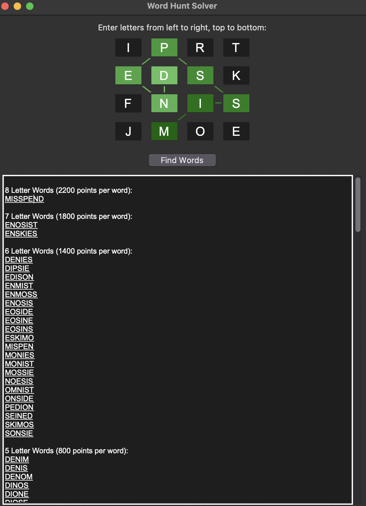

# Word Hunt Solver

---

**A fast and intuitive solver for a 4×4 Word Hunt game by Jeremy Hsiao.**  
It quickly finds all valid English words that can be formed by connecting letters (horizontally, vertically, or diagonally) on a 4×4 grid. It also highlights each found word’s path within the grid and optionally draws lines with arrows between the letters. Utilizes DFS. 

Disclaimer: Uses existing word dictionary. Not the same dictionary that Word Hunt by GamePigeon utilizes, so some words may not be valid. 

---

## Features

- **Simple UI**: Enter 16 letters in a 4×4 grid, click "Find Words," and watch as all valid words appear in the results box.
- **Click to Highlight**: Clicking any listed word will highlight the corresponding squares in the grid in an increasingly darkening green gradient and draw connecting lines, making it easy to visualize the path. 
- **Scoring**: Displays grouped words by length and calculates a total score based on the built-in word length scoring table.
- **Dictionary**: Uses a local `words_alpha.txt` for checking valid words; automatically downloads if missing.

---

## Installation

1. **Clone** this repository or download the source.  
  ```python
   git clone https://github.com/jeremyhsiao/word_hunt_solver.git
   cd word_hunt_solver
   ```

2. Install requirements:
```python
pip install -r requirements.txt
```

Verify you have Python 3.7 or higher. 

## Usage
1. Run the solver:

```python
python word_hunt.py
```

2. Enter letters into the 4×4 grid left-to-right, top-to-bottom.

3. Click the Find Words button.

4. A list of valid words will appear, grouped by length with their respective point values.

5. Click any listed word in the results to highlight its path in the grid and optionally see arrowed lines between squares.

## Example

Here’s a quick preview of the interface when it is used. 




## Logic Breakdown and Code Pipeline
Under the hood, the solver follows these main steps:

1. **Board Input** 
  * The program collects the 16 letters from the UI and constructs a 4x4 list of lists, e.g. board[row][col].

2. **Trie + DFS**
  * A trie (prefix tree) is built in WordHuntSolver.__init__ from words_alpha.txt.
  * The solver runs Depth-First Search over every cell in the grid:
    * _dfs(r, c, current_word, path, visited) is called for each (r, c) cell.
    * current_word += self.board[r][c] (line ~93) appends the letter at (r, c).
    * Check prefix with self.trie.is_prefix(current_word). If false, prune immediately.
    * Check word with self.trie.is_word(current_word). If True and len(current_word) >= 3, record it.

3. **Recording Found Words**
  * If a new word is discovered, it’s stored in self.word_info_map[current_word] = WordInfo(...).
  * That ensures we track both the word itself and the specific grid coordinates (path) for highlighting.

4. **Scoring and Sorting** 

  * Once DFS completes, we sort all found words by descending length and then alphabetically.
  * The UI displays the results grouped by length, showing the point value from self.score_lookup.

5. **Highlighting When Clicked** 
  * When you click a word in the text box, the program:
    * Clears any previous highlights (clear_highlights).
    * Looks up the path in self.solver.word_info_map[clicked_line].
    * Highlights each square in green (.config(bg="#90EE90")).
    * Draws green arrowed lines between consecutive squares in the path using a Canvas call (create_line(...)).
    * When you click a word, each step in its path is known from the DFS-recorded path, so the solver instantly highlights those cells in the grid.

